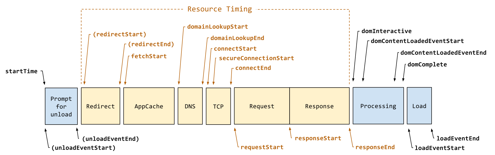

## Cieľ

Chcem pomocou jazyka JavaScript zmerať a zobraziť čas načítania webovej stránky v prehliadači.

## Riešenie

Čas načítania, respektíve časy rôznych činností, ktoré sa dejú počas toho keď sa v prehliadači zobrazuje webová stránka je možné merať a zobrazovať pomocou jazyka JavaScript.

Rozhranie `PerformanceTiming` je podporované naprieč všetkými prehliadačmi, no odporúčajú ho prestať používať, je zastarané.

```html
<span id="loadTimeElement"></span>

<script>
window.onload = function () {
  var loadTime = (window.performance.timing.domContentLoadedEventEnd-window.performance.timing.navigationStart)/1000; 
  console.log('Page load time is '+ loadTime);
  var xy = document.getElementById("loadTimeElement");
  xy.innerHTML = "Page loaded in: " + loadTime + " seconds.";
};
</script>
```

Ešte jeden príklad:

```html
<span id="loadTimeElement"></span>

<script>
window.onload = function () {
  setTimeout(function(){
    var t = performance.timing;
    var loadTime = ((t.loadEventEnd - t.navigationStart)/1000);
    console.log('Page load time is '+ loadTime);
    var xy = document.getElementById("loadTimeElement");
    xy.innerHTML = "Page loaded in: " + loadTime + " seconds.";
  }, 0);
};
</script>
```

---

Odporúčajú začať používať rozhranie `PerformanceNavigationTiming`:

```html
<span id="loadTimeElement"></span>

<script>
window.onload = function () {
  // Use getEntriesByType() to just get the "navigation" events
  var perfEntries = performance.getEntriesByType("navigation");
  var x = perfEntries[0];
  console.log("DOM complete = " + (x.domComplete)/1000);
  console.log("DOM interactive = " + (x.domInteractive)/1000);
  var xy = document.getElementById("loadTimeElement");
  xy.innerHTML = "Page loaded in: " + ((x.domComplete)/1000) + " seconds.";
};
</script>
```

Tento spôsob je zatiaľ experimentálny, je vo fáze návrhu, takzvaný „W3C Editor's Draft“. Mal by byť podporovaný vo všetkých rozšírených prehliadačoch. Viď nasledujúci obrázok z [w3c.github.io](https://w3c.github.io/navigation-timing/#process):



---

## Zdroj

- [developer.mozilla.org 1](https://developer.mozilla.org/en-US/docs/Web/API/PerformanceTiming)
- [developer.mozilla.org 2](https://developer.mozilla.org/en-US/docs/Web/API/PerformanceNavigationTiming)
- [html5rocks.com](https://www.html5rocks.com/en/tutorials/webperformance/basics/)
- [w3.org](https://www.w3.org/TR/navigation-timing-2/)
