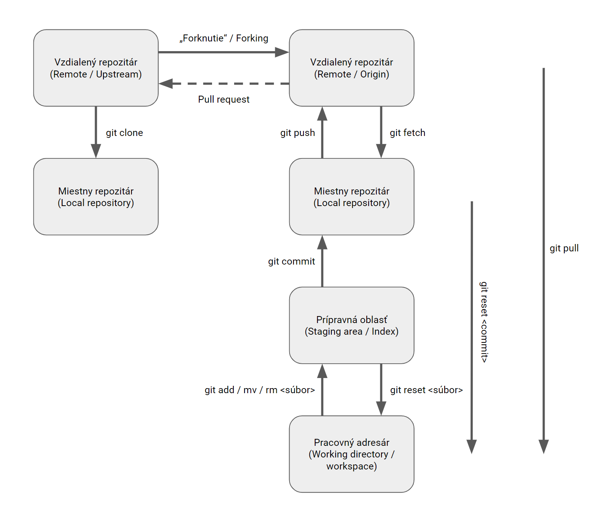

## Cieľ

Chcem objasniť základné pojmy a zosumarizovať poznatky ohľadom inštalácie a úvodného nastavenia systému na správu verzii Git.

### Príkazy

- [git version](https://git-scm.com/docs/git-version)
- [git config](https://git-scm.com/docs/git-config)

## Riešenie

### Základné pojmy

- `Repository` – repozitár je dátové úložisko. Obsahuje: súbory a dáta o nich, v podobe uložených snímok súborového systému v čase, záznamy o vykonaných zmenách, vytvorené vetvy, kópie vytvorené v určitom čase. Je to vlastne databáza obrazov stavu súborového systému, resp. záznamy o tom v akom stave sa nachádzali zahrnuté súbory v okamihoch keď boli vykonané záznamy o zmene (commits).

- `Remote repository` – vzdialený repozitár, zvyčajne niekde na internete, v cloude, u rôznych poskytovateľov (GitHub, GitLab, Bitbucket atď.), ale môže byť aj na vlastných serveroch.

- `Working directory` – lokálna pracovná kópia repozitáru v počítači v ktorej môžem pracovať so súbormi.

- `Stage area / Index` – vrstva medzi pracovným adresárom a lokálnym repozitárom. Je to vlastne zoznam zmien v súboroch o ktorých je možné vykonať záznam o zmene (commit).

- `Commit` – záznam o vykonanej zmene. Obsahuje informácie o tom kto a kedy vykonal zmenu, popis vykonanej zmeny a jednoznačný identifikátor zmeny a aj priamo jej predchádzajúcej zmeny.

- `Branch` – vetva, kópia repozitáru v istom čase, izolovaná od ostatných, v ktorej je možné vykonávať zmeny na súboroch, s vlastnou históriou. Medzi rôznymi vetvami sa je možné prepínať. Vetvy je možné naspäť začleňovať jednu do druhej, spájať ich.

- `Main` (~~Master~~) – zvyčajne hlavná, lokálna aj vzdialená vetva, v repozitári.

- `Head` – ukazuje na posledný záznam (commit) o zmene v každej vetve (branch).

- `Checkout` – prepína z aktuálnej do akejkoľvek inej vetvy, a podáva informácie o stave v danej vetve.

- `Clone` – vytvorenie vernej kópie repozitáru jeho stiahnutím, klonovaním do počítaču. Naklonovaný repozitár môžem udržiavať naďalej zosynchronizovaný s pôvodným pomocou sťahovania a zasielania zmien (`git pull / push`).

- `Fork` – vytvorenie vernej kópie repozitáru vytvorením ďalšieho, zvyčajne vzdialeného repozitáru. Vykoná sa pomocou `git clone`. Obsahuje tie isté súbory aj s históriou. Takto vytvorený repozitár vyzerá, ako novo vytvorený repozitár obsahujúci súbory, ako pôvodný v čase vytvárania kópie. Môže takto vzniknúť alternatívna cesta vývoja projektu.

„Forkovanie“ je koncept, klonovanie je proces. Obe činnosti využívajú príkaz `git clone`.

---



---

### Inštalácia

#### Linux

1. Priamo z úložiska operačného systému pomocou balíkovacieho systému.

```bash
# Debian / Ubuntu
sudo apt update
sudo apt install git

# RHEL / CentOS / Fedora / Almalinux
sudo dnf update
sudo dnf install git
```

2. Ubuntu, najnovšiu verziu z úložiska tretej strany.

```bash
sudo add-apt-repository ppa:git-core/ppa
sudo apt update
sudo apt install git
```

3. Zostaviť najnovšiu verziu (s použitím staršej verzie).

```bash
# nástroje potrebné na stiahnutie a zostavenie pre Debian a spol
sudo apt update
sudo apt install make libssl-dev libghc-zlib-dev libcurl4-gnutls-dev \
libexpat1-dev gettext

# nástroje potrebné na stiahnutie a zostavenie pre RHEL a spol
sudo dnf update
sudo dnf install gettext-devel openssl-devel perl-CPAN perl-devel \
zlib-devel gcc autoconf

# naklonujem repo so zdrojákmi
git clone https://github.com/git/git.git

# prepnem sa do novovytvoreného adresára
cd git

# zostavím a nainštalujem Git
make prefix=/usr/local all
sudo make prefix=/usr/local install
```

Správnosť inštalácie overím kontrolou nainštalovanej verzie.

```bash
git version

# ak sa ešte stále hlási staršia verzia z /usr/bin
# nechám zabudnúť všetky cesty k programom
hash -r
# a znova skúsim zobraziť verziu
git version
```

Cesta ku ručne nainštalovanej verzii `/usr/local/bin` má zvyčajne vyššiu prioritu ako cesta ku verzii inštalovanej balíčkovacím systémom `/usr/bin`.

#### Windows

```powershell
winget install --id Git.Git -e --source winget
```

Úspešnosť inštalácie overím v oboch systémoch rovnako, kontrolou nainštalovanej verzie.

```bash
git version
```

---

### Úvodné nastavenie

Po nainštalovaní potrebných balíčkov nastavím základné údaje.

``` bash
git config --global user.name "John Doe"
git config --global user.email johndoe@example.com
git config --global core.editor "nano -r 72"

# alebo prítulnejší Visual Code
git config --global core.editor "code --wait"

# predvoleny nazov hlavnej vetvy (od verzie 2.28)
git config --global init.defaultBranch main
```

Ak pracujem vo viacerých operačných systémoch, ktoré rôznym spôsobom [ukončujú riadok](https://en.wikipedia.org/wiki/Newline), je vhodné nastaviť jednotný spôsob.

```bash
# v zmiešanom prostredí MS Windows / Linux / Mac
git config --global core.autocrlf false
git config --global core.eol lf
git config --global core.filemode false

# plus v každom repozitári
git config --local core.autocrlf false
git config --local core.eol lf
git config --local core.filemode false
```

V prostredí MS Windows je možné, že príkaz `ssh.exe` je vo viacerých verziách, jedna je nainštalovaná so samotným `Git for Windows` a ďalšia ako súčasť operačného systému. Preto môže nastať situácia, že aj keď mam prístup na GitHub pomocou SSH kľúča, tak neviem repozitár sťahovať / aktualizovať pomocou SSH. Vyriešim to nastavením cesty ku príkazu s ktorým mam nastavené kľúče.

```bash
# minimalne dve verzie:
# C:\Program Files\Git\usr\bin\ssh.exe
# C:\Windows\System32\OpenSSH\ssh.exe

# overenie pristupu napriklad na GitHub
ssh -T git@github.com

# nastavenie cesty ku ssh.exe
git config --global core.sshCommand C:/Windows/System32/OpenSSH/ssh.exe
```

Nastavené hodnoty môžem zobraziť.

``` bash
git config --list

# alebo aj s umiestnením konfiguraku (--show-origin od verzie 2.8.0)
git config --list --show-origin

# a ešte aj s rozsahom pôsobnosti ( --show-scope od verzie 2.26.0)
git config --list --show-origin --show-scope
```

---

Konfiguráciu Gitu je možné vykonať na rôznych úrovniach, s rozdielnym rozsahom pôsobnosti:

- systémová úroveň
	- prepínač `--system`
	- na úrovni celého systému
	- platí pre všetkých užívateľov a pre všetky repozitáre
	- akákoľvek nižšia úroveň ju prepíše
	- v Linuxe je uložené nastavenie v súbore `/etc/gitconfig`
	- v MS Windows `C:\Program Files\Git\etc\gitconfig`

- globálna úroveň
	- `--global`
	- často používaná
	- platí pre všetky repozitáre daného užívateľa
	- nižšie úrovne ju prepíšu
	- v Linuxe `$HOME/.gitconfig`
	- v MS Windows `$env:userprofile\.gitconfig`

- lokálna úroveň
	- `--local`
	- pred nastavená úroveň, ak nie je uvedený žiadny prepínač
	- prepíše nastavenia z vyšších úrovní
	- platí len v rámci daného repozitára
	- Linux `<git-repo>/.git/config`
	- MS Windows `<git-repo>\.git\config`

- adresárová úroveň
	- `--worktree`
	- najnižšia úroveň pôsobnosti
	- prepíše všetky ostatné úrovne
	- platí len v adresári a jeho pod adresároch
	- Linux `<git-repo>/.git/config.worktree`
	- MS Windows `<git-repo>\.git\config.worktree`

---

## Zdroj

- [Pro Git](https://git-scm.com/book/cs/v2)
- [Getting Started - First-Time Git Setup](https://git-scm.com/book/en/v2/Getting-Started-First-Time-Git-Setup)
- [Customizing Git - Git Configuration](https://git-scm.com/book/en/v2/Customizing-Git-Git-Configuration)
- [Systémy pre správu verzií](https://kurzy.kpi.fei.tuke.sk/zsi/labs/02-git.html)
