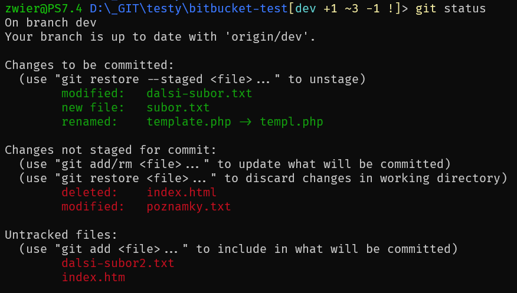
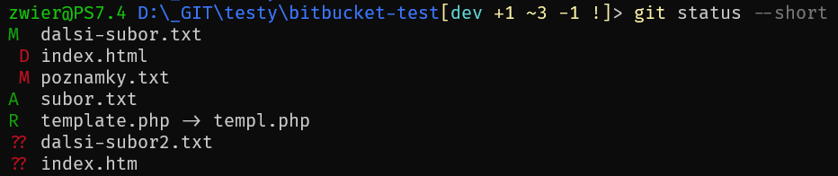

## Cieľ

Chcem zosumarizovať poznatky o spôsobe pridávania súborov do prípravnej oblasti a aj o vykonávaní záznamu o zmenách v úložisku v systéme na správu verzii Git.

### Príkazy

- [git status](https://git-scm.com/docs/git-status)
- [git add](https://git-scm.com/docs/git-add)
- [git mv](https://git-scm.com/docs/git-mv)
- [git rm](https://git-scm.com/docs/git-rm)
- [git commit](https://git-scm.com/docs/git-commit)
- [git reset](https://git-scm.com/docs/git-reset)
- [git notes](https://git-scm.com/docs/git-notes)

## Riešenie

Ak vykonám akékoľvek zmeny v súboroch, ktoré sú pod kontrolou systému na správu verzii, môžem o tom vykonať záznam, no najskôr musím presne určiť, ktoré zmeny to sú.

Toto je vlastne kľúčová úloha systému Git, uchovávať presné záznamy o tom čo presne a kým presne bolo pozmenené. V prípade potreby je teda možné „jednoducho“ zmeny zvrátiť. A preto je veľmi dôležité pridávať a následne zaznamenávať zmeny po nejakých zmysluplných, logických častiach.

Ak napríklad na danom projekte vykonám zmeny v dokumentácii, vo vzhľade aplikácie, vo vnútornej logike, a ešte aj v spôsobe ukladania dát, tak je vyslovene nevhodné všetky tieto nesúvisiace zmeny pridať spolu do prípravnej oblasti  a vykonať o nich jeden spoločný záznam o zmene. Na to presne využijem pridávanie do prípravnej oblasti. Pridám tam len tie súbory, alebo ich časti, ktoré spolu súvisia a tvoria jeden logický celok, pridajú jednu vlastnosť alebo odstránia jeden problém. Dodržiavať túto zásadu o pridávaní zmien po menších častiach je veľmi dôležité pravidlo!

---

### Zobrazenie stavu

Skôr než začnem zaznamenávať zmeny potrebujem zobraziť stav a situáciu v repozitári. Prvý zadávaný príkaz po vstupe do adresáru v ktorom je repozitár je :

```bash
git status
```

Zobrazuje súbory (prípadne celé cesty), ktoré:
- sú zmenené v prípravnej oblasti (`index`) oproti poslednej zaznamenanej zmene (`HEAD`) => teda už boli pridané do indexu pomocou git add a mal by nasledovať git commit
- sú zmenené v pracovnom adresári (`working tree`) oproti prípravnej oblasti (`index`) => teda boli zmenené, ale ešte nie sú pridané do indexu, malo by nasledovať git add
- ešte nie sú vôbec sledované => teda úplne nove súbory, alebo súbory premenované v pracovnom adresári, malo by nasledovať taktiež git add



Ak je zmenených súborov veľké množstvo, alebo len jednoducho chcem vidieť kratší výpis, môžem použiť prepínač `-s / --short`.

```bash
git status --short
```

Rozdielne / zmenené súbory sú vo výpise na začiatku riadku označené písmenom označujúcim typ ich zmeny:
- M - zmenené (obsah súboru)
- T - zmenené (typ súboru)
- A - novo pridané do prípravnej oblasti
- D - zmazané
- R - premenované (len index oproti HEAD)
- C - kopírované (?)
- ? - nesledované

Pokiaľ je písmeno na mieste prvého znaku, na začiatku riadku, ide o zmenu v indexe oproti HEAD, pokiaľ je na mieste druhého znaku, ide o zmenu v pracovnom adresári oproti indexu.



### Pridanie súborov do prípravnej oblasti

Zmenené súbory, alebo ich časti môžem pridať do zoznamu zmien – prípravnej oblasti (`index` alebo `staging area`) pomocou príkazu `git add`.

```bash
# súbory môžem pridať jednotlivo podľa mien
git add subor01 subor02

# alebo podľa časti mena
git add subor*

# môžem pridať všetky nové a modifikované, ale nie zmazané
git add .
# na konci je bodka

# všetky modifikované a zmazané, ale nie nové
git add -u

# úplne všetky, aj nové, aj modifikované aj zmazané
git add -A
```

Môžem pridať len časť zmien, nie celé súbory.

```bash
git add --interactiv

# alebo len pre konkrétny súbor
git add --patch nazov_suboru

# alebo 
git add -p nazov_suboru
```

Zobrazí sa vybraná časť zmeny (zelenou farbou) a ponuka možností:

- `y` – pridať túto časť (hunk) do prípravnej oblasti
- `n` – nepridať túto časť do prípravnej oblasti
- `q` – skončiť a nepridať nič viac
- `a` – pridať túto a všetky nasledujúce časti
- `d` – nepridať túto ani žiadnu nasledujúcu časť
- `g` – vybrať časť kam sa presunúť
- `/` – nájsť časť podľa zadaného vzoru (regex)
- `j` – ponechať túto časť nevybratú a prejsť na ďalšiu nevybratú
- `k` – ponechať túto časť nevybratú a prejsť na predošlú nevybratú
- `K` – ponechať túto časť nevybratú a prejsť na predošlú časť
- `s` – rozdeliť túto časť na menšie
- `e` – ručne rozhodnúť o tejto časti
	- nahradiť znak mriežka `#` znakom pre pridanie `+` / odobratie `-`
- `?` – vytlačiť pomoc

Po skončení výberu častí, môžem skontrolovať správnosť tým, že zobrazím zmeny, ktoré sú pridané do prípravnej oblasti.

```bash
git diff --cached

# alebo to isté
git diff --staged
```

V prípade, že chcem odobrať z prípravnej oblasti omylom pridaný súbor alebo jeho časť, môžem to urobiť tiež aj interaktívne.

```bash
# odbratie celého suboru
git reset -- subor

# interaktívne odobratie
git reset --patch

# alebo skrátene
git reset -p
```

Zobrazia sa časti pridané do prípravnej oblasti označené zelenou a ponuka možností podobná ako vyššie pri pridávaní. Požadované časti môžem odoberať z prípravnej oblasti.

---

### Odobratie  / presunutie súborov v úložisku

V prípade potreby odstránenia súboru z repozitáru alebo jeho presunu na iné miesto v repozitári nevykonám to na úrovni manipulácie so súbormi v súborovom systéme (príkazy cp, mv, alebo grafický správca súborov), ale takúto zmenu vykonám pomocou príkazov git.

```bash
# na presun suboru do adresára
git mv stara/cesta/subor novy/adresar

# na presun viacerých súborov do adresára
git mv subor1 subor2 adresar

# na odstránenie
git rm subor
```

---

### Zaznamenanie zmien v úložisku

Ak už mám v prípravnej oblasti pridané (odstránené, presunuté) požadované súbory, alebo ich časti, môžem o tom vykonať záznam - záznam o zmene v úložisku (`commit`).

```bash
git commit
```

Po zadaní príkazu sa spustí predvolený editor v ktorom je potrebné napísať doplňujúce informácie ohľadom zaznamenávanej zmeny.

Záznam o zmene by mal obsahovať aspoň dve časti:

- subjekt - nadpis, stručné zhrnutie
- telo - podrobnejšie vysvetlenie

Odporúčania ako správne napísať správu o zmene (`commit message`):

- Nepoužívať prepínač `-m` a `--message=`
- Oddeliť subjekt a telo jedným prázdnym riadkom
- Obmedziť subjekt na maximálne 50 znakov
- Začať subjekt veľkým písmenom
- Neukončiť subjekt bodkou
- Použiť rozkazovací spôsob v subjekte
- Zalamovať riadky v tele na 72 znakov
- Využiť telo na vysvetlenie čo a prečo namiesto ako

Takto zaznamenaná zmena má svoj jednoznačný identifikátor, ktorý sa vypočíta ako SHA-1 (kryptografická hašovacia funkcia) z objektu ktorý obsahuje tieto informácie:

- pripojená správa o zmene
- údaje o osobe ktorá zmenu aplikovala (meno a email)
- dátum a čas aplikovania zmeny
- údaje o autorovi, osobe ktorá zmenu napísala (meno a email)
- dátum a čas napísania zmeny
- SHA-1 vypočítaná z celého pracovného adresáru
- jednoznačný identifikátor priamo predchádzajúcej zaznamenanej zmeny

Výsledkom výpočtu je 160 bitový reťazec (20 bytov), ktorý je možné zapísať pomocou 40 znakov. Z toho už prvých sedem znakov postačuje na jednoznačné odlíšenie uložených verzii.

Z toho vyplýva, že aj sebe menšia zmena akéhokoľvek z vyššie uvedených údajov spôsobí vygenerovanie nového, iného a jednoznačného identifikátora.

---

### Zaznamenanie zmien v submodule

Submodul je vlastne akoby ďalší repozitár vnorený v hlavnom repozitári. Čiže zaznamenanie zmien bude spočívať v dvoch krokoch, najskôr zaznamenám zmeny vo vnorenom submodule a následne v hlavnom / nadradenom repozitári.

```sh
cd adresar/so/submodulom
git add zmeneny_subor_01
git commit
git push

cd ../hlavny_projekt
git add adresar/so/submodulom
git commit
git push
```

---

### Odstránenie / zmena záznamov o zmene (lokálne)

Pre nasledujúce platí zásadná podmienka, že vykonané záznamy o zmene (`git commit`) ešte neboli odoslané na vzdialené úložisko!

Ak potrebujem len zmeniť text v poslednom zázname o zmene, ktorý ešte nebol odoslaný na vzdialený repozitár.

```bash
git commit --amend
```

Pokiaľ nebol ešte záznam o zmene odoslaný na vzdialené úložisko (`git push`), môžem takýto záznam odstrániť tak, že ponechám zmenené súbory v prípravnej oblasti a odstránim len záznam o zmene.

```bash
git reset --soft HEAD~
```

Alebo môžem spolu s odstránením záznamu o zmene odobrať aj pozmenené súbory z prípravnej oblasti (`unstage`).

```bash
git reset HEAD~

# alebo tiež
git reset --mixed HEAD~

# ak som zadal git reset HEAD~ omylom, toto mozem zvratit
git reset 'HEAD@{1}'
```

Ak som omylom zahrnul do posledného zaznamenaného záznamu o zmene aj nejaký súbor ktorý tam nemal byť, môžem záznam zrušiť, odobrať konkrétny súbor z prípravnej oblasti a opätovne vykonať záznam o zmene, no už bez odobratého súboru, ale zato aj s pôvodným obsahom sprievodného záznamu o zmene.

```sh
git reset --soft HEAD~1
git reset HEAD odoberany_subor.txt
git commit -c ORIG_HEAD
```

Alebo ešte môžem aj okrem odstránenia posledného záznamu o zmene a odobratí pozmenených súborov z prípravnej oblasti, zvrátiť aj zmeny na tých súboroch. Čiže pracovný adresár sa ocitne ako v stave tesne po predposlednom zázname o zmene.

```bash
git reset --hard HEAD~

# môžem kompletne odstrániť aj viac posledných zmien !!
git reset --hard HEAD~3
# odstráni 3 posledné záznamy o zmene aj so všetkými zmenami v súboroch
# plus odstrání všetky súbory pridané počas posledných 3 záznamov !!
```

**Pozor!** Toto teda odstráni aj novo pridané súbory, nie len zmeny na starých! A taktiež odstráni **nevratne** všetky zmeny o ktorých nebol vykonaný záznam o zmene!

Preto ak potrebujem vykonať `git reset --hard` je vyslovene vhodné zmeny ktoré ešte nie sú zaznamenané a chcem ich uchovať odložiť bokom - [git stash](https://opensource.com/article/21/4/git-stash).

---

### Šablóna pre záznam o zmene

Keďže záznam o zmene je veľmi dôležitá súčasť systému na správu verzii Git, lebo umožňuje iným alebo aj mne samému neskôr pochopiť o čo v danej zmene išlo, je potrebne dodržiavať isté pravidlá pri písaní týchto záznamov o zmene (viď [vyššie](#zaznamenanie-zmien-v-úložisku)).

Šablóna alebo pred vyplnený vzor záznamu o zmene mi uľahči písanie správnych záznamov tým, že ma núti dodržiavať osnovu, presnú, vopred definovanú štruktúru záznamu.

Najskôr si vytvorím požadovanú šablónu, do ktorej zakomponujem všetky potrebné pravidlá. V domovskom adresári vytvorím napríklad súbor `~/.gitmessage`.

```
######## 50 znakov ###############################
#<typ>[volitelne oblast]: <samotny subjekt>#######
##################################################
#typ: Nové / Oprava / Test / Späť / Vzhľad / Iné #
#oblast: (poznamky) / (recepty) / (galeria) / (tema)
##################################################
# SUBJEKT: #######################################
##################################################

##################################################
# Nezabudnut vynechat jeden prazdny riadok #######
# medzi nadpisom / subjektom a telom zaznamu. ####
##################################################

######## 72 znakov #####################################################
# Telo zaznamu o zmene moze byt zlozene z viacerych casti###############
# Dolezitejsie je vysvetlit co? a preco? nez ako? ######################
########################################################################
# TELO: ################################################################
########################################################################
# Problem, uloha, dovod, ucel, ciel, pouzivatelsky pribeh atd.

########################################################################
# Riesenie alebo zoznam zmien
#
########################################################################
# Specialne pokyny, testovacie kroky, spoluautori s emailom atd.
#
```

Môžem použiť jednu šablónu pre všetky repozitáre, alebo mať pre každé úložisko iný pred vyplnený vzor. Šablónu pridám v príkazovom riadku, alebo úpravou zodpovedajúceho konfiguračného súboru.

```bash
# pre vsetky repozitare
git config --global commit.template ~/.gitmessage

# alebo len pre jeden repozitar
cd repozitar
git config commit.template ~/.gitmessage
```

### Poznámky ku záznamu o zmene

Súčasťou každého záznamu o zmene je aj sprievodný text (`commit message`), ktorý je však veľmi úzko previazaný so samotným záznamom a teda aj veľmi malá zmena v sprievodnom texte spôsobí, že je to už zase úplne nová zmena :) Na to aby som mohol ku záznamu o zmene pridávať neskôr aj ďalšie informácie bez toho aby som pozmenil samotný záznam o zmene, môžem použiť poznámky.

Praktické využitie poznámok môže byt mnohoraké:
- sledovanie času stráveného na danej zmene
- doplňujúce informácie o kontrole a testovaní
- doplňujúce informácie o zmenách v kóde
- odkaz na vlákno / kanál kde sa diskutuje o danej zmene

```bash
# zobrazi vsetky poznamky v podobe:
# <jedinecne cislo poznamky> <jedinecne cislo zmeny>
git notes

# alebo to iste
git notes list

# prida poznamku ku poslednemu zaznamu o zmene (HEAD)
git notes add

# prida poznamku ku zaznamu s SHA-1 a95a584
git notes add a95a584

# zobrazi poznamku pridanu ku poslednemu zaznamu
git notes show

# zobrazi poznamku pridanu ku zaznamu s SHA-1 a95a584
git notes show a95a584

# pripoji dalsiu poznamku ku poslednemu zaznamu o zmene
git notes append -m "text poznamky"
```

Ako poznámky ku záznamu o zmene môžem pripojiť aj celé ďalšie textové súbory - napríklad výstupy testov, automatizácie atď., pomocou prepínačov `--ref` - určím kam sa majú poznámky ukladať a `-F` - nastavím súbor ktorý sa ma pripojiť.

```bash
# prida ku poslednemu zaznamu o zmene (HEAD)
# subor .\build\junit.xml
# a ulozi ho v refs/notes/junit
git notes --ref junit add -F .\build\junit.xml

# zobrazi poznamku pridanu ku poslednemu zaznamu
# ulozenu v refs/notes/junit
git notes --ref junit show
```

Podobne ako značky (`tags`) ani poznámky nie sú v predvolenom nastavení posielané / sťahované na / zo vzdialeného úložiska a je to potrebne urobiť v samostatnom kroku.

```bash
# odoslanie poznamok na vzdialene ulozisko
git push origin refs/notes/commits

# Stiahnutie vsetkych poznamok zo vzdialeneho uloziska do lokalneho
git fetch origin refs/notes/commits:refs/notes/commits
```

---

## Zdroj

- [The anatomy of a Git commit](https://blog.thoughtram.io/git/2014/11/18/the-anatomy-of-a-git-commit.html)
- [How to Write a Git Commit Message](https://cbea.ms/git-commit/)
- [Conventional Commits](https://www.conventionalcommits.org/en/v1.0.0/)
- [Improve your CI-CD-Workflow with Git-Notes](https://medium.com/digitalfrontiers/git-your-stuff-together-storing-test-reports-along-your-sources-with-git-notes-f5c8068dc981)
