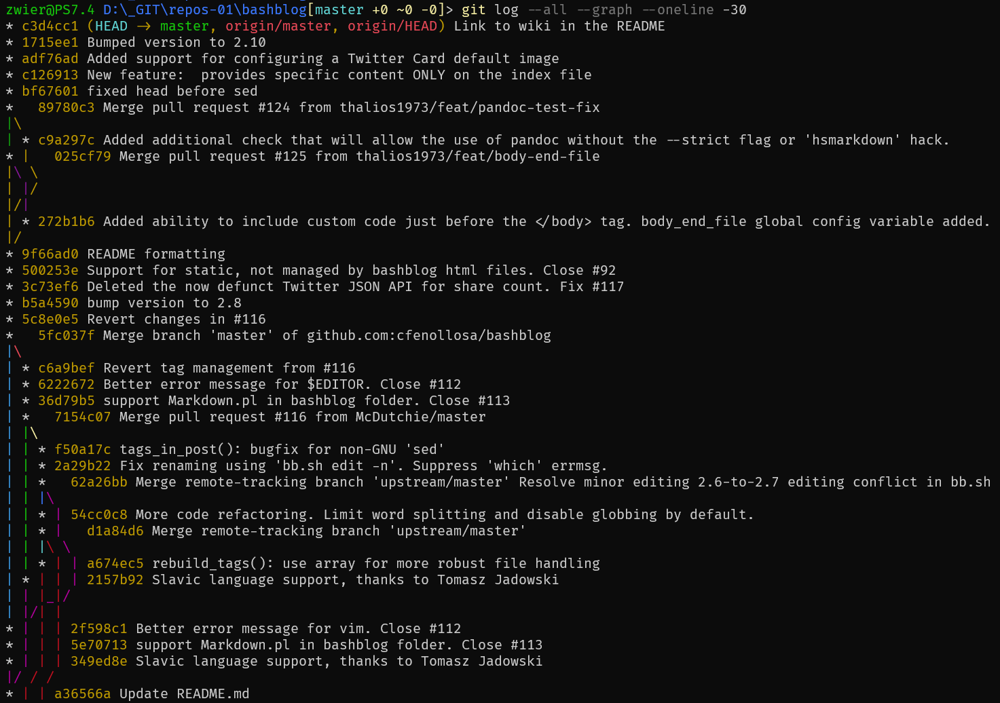
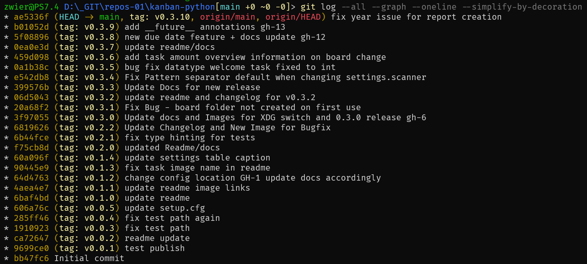
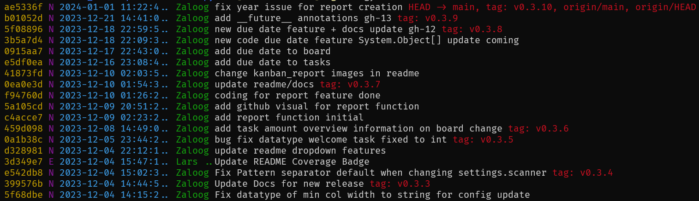
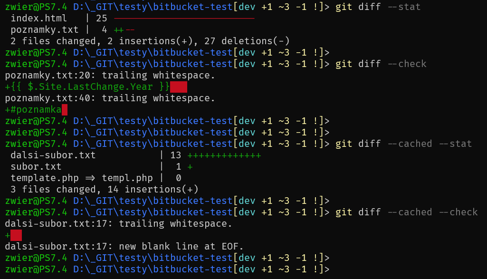
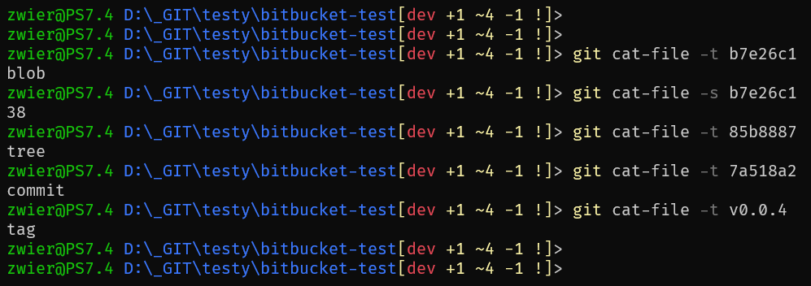
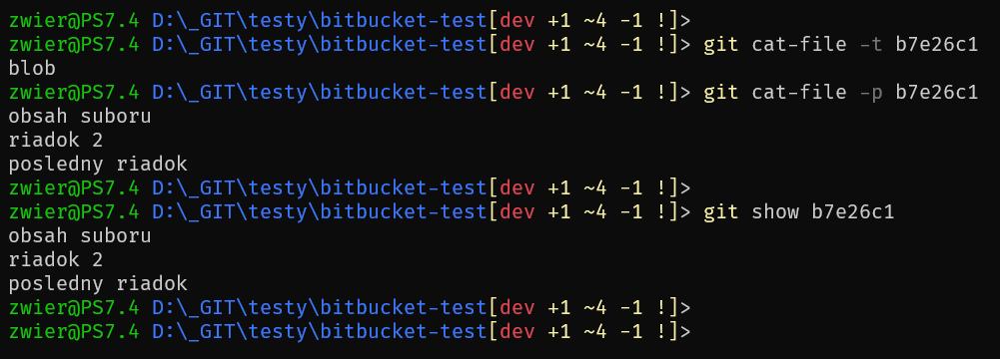
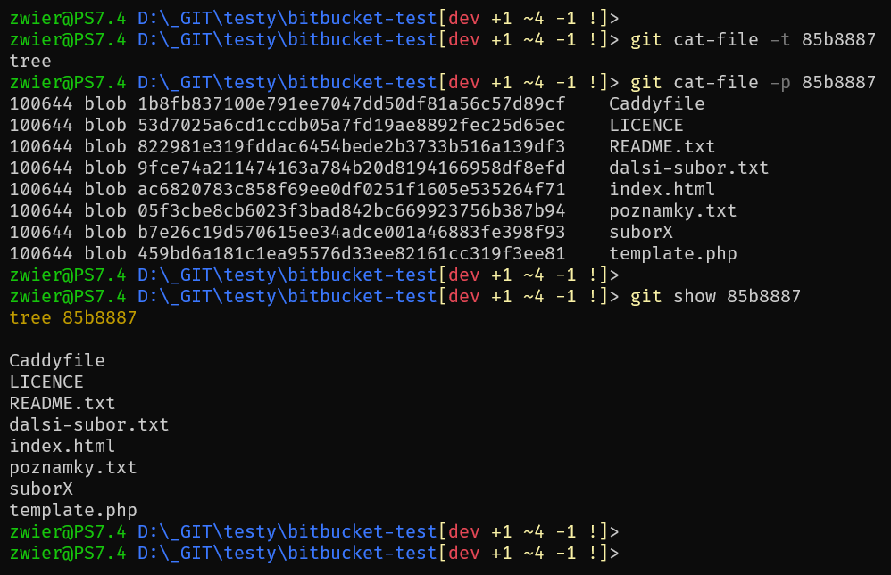
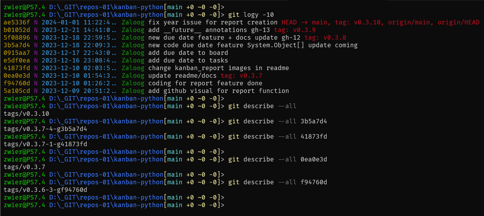

## Cieľ

Chcem zosumarizovať poznatky o zobrazení histórie zmien v systéme na správu verzii Git, o zobrazení rozdielov medzi jednotlivými zaznamenanými zmenami, o zobrazení rôznych objektov a o zobrazení celkového pohľadu na stav v repozitári.

### Príkazy

- [git log](https://git-scm.com/docs/git-log)
- [git shortlog](https://git-scm.com/docs/git-shortlog)
- [git diff](https://git-scm.com/docs/git-diff)
- [git grep](https://git-scm.com/docs/git-grep)
- [git show](https://git-scm.com/docs/git-show)
- [git cat-file](https://git-scm.com/docs/git-cat-file)
- [git describe](https://git-scm.com/docs/git-describe)

## Riešenie

Git – systém na správu verzii je komplexný a robustný systém, ktorý môže zaznamenávať všetko čo sa deje v repozitári. A preto sú potrebné aj nástroje ako tieto zmeny kontrolovať, sledovať a ďalej spracovávať.

### Zobrazenie histórie zmien

Jednou zo základných vlastností gitu je zaznamenávanie zmien a tých v čase pribúda. Pomocou príkazu `git log` môžem zobraziť v rôznej podobe, predvolene prevrátený chronologický zoznam záznamov o zmenách v repozitári.

```bash
# prevrateny chronologicky zoznam (od najnovsich)
# vsetkych zmien veducich ku aktualnemu stavu
git log

# zoznam vsetkych zmien, ktore su nadradene / vedu
# ku zmene so sha1 <cisloZmenyA>
git log <cisloZmenyA>

# zoznam vsetkych zmien, ktore su nadradene / vedu
# ku zmenam so sha1 <cisloZmenyA> a <cisloZmenyB>
# ale zaroven nevedu ku zmene zo sha1 <cisloZmenyC>
git log <cisloZmenyA> <cisloZmenyB> ^<cisloZmenyC>

# zoznam vsetkych zaznamenanych zmien v rozpati
# od zmeny cc15c86 az po aktualny stav
git log cc15c86..HEAD
# to iste mozem zapisat predchadzajucim sposobom
git log HEAD ^cc15c86
# alebo este inak :)
git log ^cc15c86 HEAD

# len posledna zaznamenana zmena,
# ale aj so suhrnym prehladom zmien 
# v jednotlivych zmenenych suboroch
git log -1 --stat
```
Príkaz `git log` má obrovské množstvo prepínačov pomocou ktorých môžem veľmi podrobne nastaviť spôsob zobrazenia histórie zmien v repozitári.

```bash
# zo vsetkych vetiev, zobrazit vetvenie,
# kratky vypis, poslednych 30 zaznamov
git log --all --graph --oneline -30
```



```bash
# podobne ako vyssie, ale najkratsia mozna cesta
# veduca od pociatku ku aktualnemu stavu
git log --all --graph --oneline --simplify-by-decoration
```



Poradie v akom sú jednotlivé údaje o zmenách zobrazené, ako aj farbu je možné taktiež nastaviť podľa vlastných potrieb.

```bash
# zltou skratene cislo zmeny (%h)
# fialovou platnost podpisu (% G?) (https://git-scm.com/docs/git-log#Documentation/git-log.txt-emGem)
# modrou datum vo formate ISO-8601 (%ai) skrateny na 20 znakov
# zelenou autor zmeny (%aN) skrateny na 7 znakov
# bielou subjekt (%s) sprievodneho textu zaznamu o zmene
# a nakoniec cervenou referencne meno (% D) 
git log --pretty=format:'%C(auto,yellow)%h%C(auto,magenta)% G? %C(auto,cyan)%>(20,trunc)%ai %C(auto,green)%<(7,trunc)%aN%C(auto,reset)%s%C(auto,red)% gD% D' -20

# alebo to iste, ale namiesto datumu je zobrazena uplynuta doba
git log --pretty=format:'%C(auto,yellow)%h%C(auto,magenta)% G? %C(auto,cyan)%>(20,trunc)%ad %C(auto,green)%<(7,trunc)%aN%C(auto,reset)%s%C(auto,red)% gD% D' --date=relative -20
```



V zozname zaznamenaných zmien je možné zoskupiť jednotlivé zmeny podľa autora. Použijem na to príkaz `git shortlog`.

Jednotlivé zmeny uvedené pri autorovi sú na rozdiel od `git log` ale zoradené chronologicky, teda od najstaršej. Každá zmena je na novom riadku a je uvedený len subjekt sprievodného textu záznamu o zmene (`commit message`).

```bash
# zoznam vsetkych zmien, v aktualnej vetve, zoskupeny podla autorov
# autori su zoradeni abecedne, zmeny od najstarsej
git shortlog

# abecedny zoznam vsetkych autorov zmien, vo vsetkych vetvach
# ale len pocet zmien, bez `commit message`
git shortlog --summary --all
git shortlog -s --all

# ako vyssie, ale zoznam zoradeny podla poctu zmien
git shortlog --summary --all --numbered
git shortlog -sn --all

# a este aj s emailami
git shortlog -sne --all
```

---

### Zobrazenie rozdielu medzi verziami

Aby som mohol dôsledne sledovať zmeny, musím byť schopný detailne porovnať rôzne verzie súboru v čase, resp. v rôznych fázach procesu zaznamenávania týchto zmien, alebo v rôznych vetvách. Na to je určený príkaz `git diff`.

Bez ďalších parametrov zobrazí všetky zmeny ktoré ešte nie sú pridané do indexu, teda všetko pozmenené oproti stavu ktorý už je zaznamenaný. Zobrazené zmeny je možné pridať do indexu (prípravnej oblasti) príkazom `git add`.

```bash
git diff

# to iste, teda zmeny ktore este nie su pridane do indexu,
# ale nie v porovnani s aktualnou vetvou,
# ale v porvnani s vetvou 'ina_vetva'
git diff ina_vetva
```

Výstup poskytne informácie o tom, ktorých súborov sa to týka a rozdiely zobrazí tak, že červenou zobrazí pozmenený riadok v pôvodnej podobe a zelenou ten istý riadok v novej zmenenej podobe. Riadky pred alebo za zmenou, ktoré nie sú zmenené sú zobrazené bielou farbou.

Ak nechcem vidieť zmeny samotné, ale postačuje mi len zoznam zmenených súborov a súhrny pohľad na zmeny, použijem prepínač `--stat`.

```bash
git diff --stat

# podobne, ale vhodnejsie na strojove spracovanie
git diff --numstat
```

Zmeny, ktoré už boli pridané do prípravnej oblasti / indexu (pomocou `git add`), ale ešte nebol vykonaný záznam o zmene (`git commit`), tak takéto zmeny môžem zobraziť pomocou prepínača `--cached` alebo `--staged`.

```bash
git diff --cached

# alebo to iste
git diff --staged

# prepinace mozem kombinovat
git diff --staged --stat
```

Ak chcem môžem zobraziť oba druhy zmien spolu, teda aj tie zmeny ktoré ešte nie sú presunuté do indexu spolu s tými ktoré už sú.

```bash
git diff HEAD
```

Pred tým než vykonám záznam o zmene (`git commit`) môžem pomocou prepínača `--check` zobraziť upozornenie, ak v zmenených súboroch sú chyby formátovania (`whitespace errors`), ako napríklad zbytočné a ťažko viditeľné znaky typu medzera na konci riadku, či medzera hneď za znakom tabulátor.

```bash
# skontroluje zmenene subory, ktore este nie su pridane do indexu
git diff --check

# skontroluje zmenene subory, ktore uz su pridane do indexu
git diff --cached --check
```



Podobne ako pri záznamoch o zmenách aj pri rozdieloch môžem porovnať dve rôzne verzie a zobraziť rozdiely medzi nimi.

```bash
# zobrazi rozdiely medzi predposlednou a poslednou zaznamenanou zmenou
git diff HEAD~1 HEAD

# to iste, ale zobrazi len rozdiely pre subor.txt
git diff HEAD~1 HEAD subor.txt

# zobrazi rozdiely medzi starsim stavom, zaznamenanym ako <cisloZmenyA>
# a medzi novsim stavom, zaznamenanym ako <cisloZmenyB>
git diff <cisloZmenyA> <cisloZmenyB>

# mozem takto porovnat cele vetvy
git diff main dev01

# to iste
git diff main..dev01
```

Pomocou prepínača `--no-index` môžem zobraziť rozdiely medzi dvoma súbormi aj keď nie sú súčasťou systému na správu verzii.

```bash
git diff --no-index cesta/ku/suboru-01 cesta/ku/suboru-02
```

Výstup z `git diff` viem presmerovať do súboru, odložiť na neskôr a všetky takto uložené zmeny môžem aplikovať inokedy podľa potreby. Nesmiem zabudnúť že `git apply` zmeny vykoná na daných súboroch ale aplikované zmeny musím ešte pridať do prípravnej oblasti (`git add`) a vykonať záznam o zmene (`git commit`).

```bash
# ulozenie zmien na neskor
git diff > zmeny.patch

# aplikovanie ulozenych zmien
git apply zmeny.patch
```

---

### Zobrazenie riadkov obsahujúcich vzor

Na prehľadávanie súborov a zobrazenie riadkov obsahujúcich zadaný vzor slúži príkaz `git grep`.

Linux síce obsahuje vlastný príkaz [grep](https://www.gnu.org/software/grep/manual/) a PowerShel ma tiež svoj [Select-String](https://learn.microsoft.com/en-us/powershell/module/microsoft.powershell.utility/select-string?view=powershell-7.4), no `git grep` sa líši okrem iného v tom, že prehľadáva (logicky) len súbory pod kontrolou systému na správu verzii. A ešte navyše prehľadáva aj všetky ostatné verzie (staršie revízie, iné vetvy, atď.), nie len aktuálnu, v ktorej môže hľadať aj bežný `grep`!

```bash
# vyhladat a zobrazit vsetky riadky zacinajuce danym retazcom
# bez ohladu na velkost pismen, zobrazit aj cisla riadkov
# hladat v adresari "content"
# v aktualnom pracovnom adresari/strome (aktualna vetva / verzia)
git grep -n -i '^draft: true' -- ./content

# to iste, ale nie v adresari "content"
# ale kdekolvek v suboroch s koncovkou "md"
# v aktualnom pracovnom adresari
git grep -n -i '^draft: true' -- '*.md'

# vuhladata a zobrazit vsetky riadky obsahujuce dany retazec
# bez ohladu na velkost pismen, zobrazit aj cisla riadkov
# kdekolvek, vratane submodulov,  v suboroch s koncovkou "html"
# v aktualnom pracovnom adresari
git grep -n -i --recurse-submodules 'lastmod' -- '*.html'

# vyhladat vsetky riadky zacinajuce s retazcom "mongo"
# bez ohladu na velkost pismen, zobrazit aj cisla riadkov
# kdekolvek, kedykolvek
# vo vsetkych aj inych ulozenych verziach, vetvach
git grep -n -i '^mongo' $(git rev-list --all)

# to iste ak by som dostal hlasku "Argument list too long"
git rev-list --all | xargs git grep -n -i '^mongo'

# to iste ak by som dostal hlasku "Argument list too long"
# ale v PowerShell, bo tam nie je 'xargs'
git rev-list --all | % { git grep -n -i '^mongo' $_ }

# vyhladat vsetky riadky zacinajuce s retazcom "mongo"
# bez ohladu na velkost pismen, zobrazit aj cisla riadkov
# hladat v adresari "content"
# vo vsetkych aj inych ulozenych verziach, vetvach
git grep -n -i '^mongo' $(git rev-list --all -- ./content) -- ./content
```

---

### Zobrazenie rôznych typov objektov

Príkaz `git show` môže v systéme na správu verzii Git zobraziť objekty ako:

- blob - zobrazí obsah blobu
- tree - zobrazí zoznam objektov v tree
- commit - zobrazí priloženú správu commitu a aj zmeny samotné
- tag - zobrazí priloženú správu tagu a commit na ktorý odkazuje

Ako meno objektu, ktorý chcem zobraziť, môžem použiť akékoľvek platné označenie [revízie](https://git-scm.com/docs/gitrevisions):

- celý alebo skrátený SHA-1 hash objektu
- výstup z príkazu `git describe`
- odkazujúce meno, ako napríklad main, heads/main, refs/heads/main
- znak `@` - samostatne je to skratka pre HEAD
- `@{n}` - n-tý predchádzajúci záznam o zmene v aktuálnej vetve
- `vetva@{n}` - n-tý predchádzajúci záznam o zmene vo vetve "vetva"
- a mnoho ďalších spôsobov zápisu

Ak nie je použité žiadne meno objektu, prednastavená hodnota je HEAD, zvyčajne teda zobrazí obsah posledného záznamu o zmene (`commit`) v aktuálnej vetve (`branch`).

Obsah alebo detaily o objektoch v Gite viem ešte zobraziť aj pomocou príkazu `git cat-file`.

Pre mená objektov platí to isté čo vyššie. Spolu s `git cat-file` môžem použiť prepínače, napríklad `-t` - zobrazí typ objektu, `-s` - zobrazí veľkosť objektu, `-p` - zobrazí obsah objektu.

```bash
# zobrazi info o poslednom commite
git show

# to iste
git show HEAD

# a este raz to iste
# v prostredi powershell je potrebne zadat:
# git show "@"
git show @

# to iste, info o poslednom commite,
# ale nezobrazi rozdiely/zmeny
git show -s

# zobrazi info o objekte,
# ktoreho jednoznacny identifikator
# sa zacina zadanymi znakmi
git show 7a518a2

# zobrazi obsah objektu,
# ktoreho jednoznacny identifikator
# sa zacina zadanymi znakmi
git cat-file -p 7a518a2
```





---

### Zobrazenie zrozumiteľnejších mien verzii

Ak potrebujem dať objektu v repozitári zrozumiteľnejšie meno založené na dostupných pomenovaných odkazoch viem použiť príkaz `git describe`. Ako meno objektu môžem zadať tak ako vyššie, celý alebo skrátený hash, atď., ak neuvediem nič, predvolene sa budem pýtať na HEAD.

Príkaz sa snaží nájsť najbližší tag k zadanému objektu. Ak na zadaný objekt/commit odkazuje tag, tak sa zobrazí len ten, inak sa zobrazí reťazec pozostávajúci z najbližšieho nájdeného tagu, za ktorým nasleduje pomlčka, za ňou počet záznamov o zmene, ktoré boli vykonané po danom tagu a viedli ku zadanému objektu/commitu, nasleduje ďalšia pomlčka, a po nej písmeno `g` (ak je systém na správu verzii práve git) spojené so skráteným jednoznačným identifikátorom (SHA-1 hash) samotného zadaného commitu, uf.

```bash
git describe

# to iste
git describe HEAD

# a este raz to iste
# v prostredi powershell je potrebne zadat:
# git describe "@"
git describe @

# nepouzije len anotovane tagy, ale oba druhy
# teda aj tagy bez sprievodnej spravy/anotacie
# takzvane lahke tagy (light tags)
git describe --tags

# nepouzije len anotovane tagy,
# ale aj akekolvek dostupne pomenovane odkazy
# ktore sa nachadzaju v "refs/"
# teda vetvy, vzdialene vetvy, lahke tagy
git describe --all
```



---

## Zdroj

- [2.3 Git Basics - Viewing the Commit History](https://git-scm.com/book/en/v2/Git-Basics-Viewing-the-Commit-History)
- [How to grep (search through) committed code in the Git history](https://stackoverflow.com/questions/2928584/how-to-grep-search-through-committed-code-in-the-git-history)
- [7.1 Git Tools - Revision Selection](https://git-scm.com/book/en/v2/Git-Tools-Revision-Selection)
