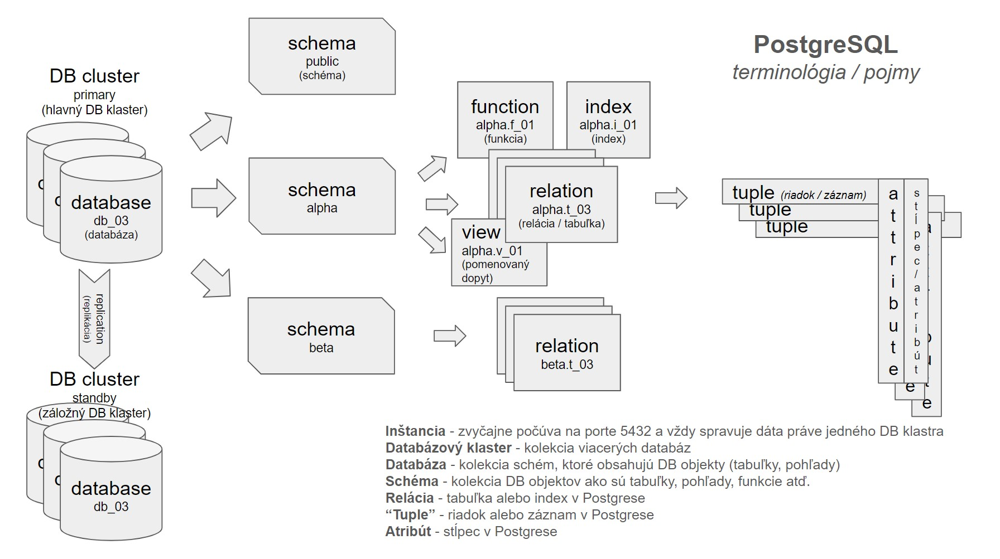

## Cieľ

Chcem objasniť základné pojmy a zosumarizovať získané poznatky o databázovom systéme PostgreSQL.

## Riešenie

[PostgreSQL](https://www.postgresql.org/docs/current/intro-whatis.html) je podľa ich vlastnej definície výkonný objektovo-relačný databázový systém s otvoreným zdrojovým kódom. Počiatky jeho vývoja siahajú do roku 1986 kde vznikol ako súčasť projektu POSTGRES na Kalifornskej univerzite v Berkeley v Spojených štátoch.

V rebríčku [DB-Engines Ranking](https://db-engines.com/en/ranking) je PostgreSQL na 4. mieste aj v rámci všetkých hodnotených databáz aj v podkategórii relačné databázy.

PostgreSQL je implementovaný v jazyku C, široko dostupný na všetkých bežných operačných systémoch a funkcionalitu je možné ďalej rozširovať pomocou veľkého množstva doplnkov.

### Základné pojmy

- `postgres` – je PostgreSQL databázový server

- `instance` - inštancia, jedna `postgres` inštancia môže vždy spravovať len dáta jedného databázového klastra, zvyčajne načúva na porte 5432, na jednom fyzickom / virtuálnom serveri môže byť spustených viacero inštancii (musia samozrejme počúvať na rozdielnych portoch)

- `database cluster` – databázový klaster - kolekcia viacerých databáz spravovaná jednou inštanciou PostgreSQL databázového servera

- `database` – databáza, kolekcia viacerých schém, ktoré obsahujú všetky potrebné databázové objekty, ako sú napríklad tabuľky či pohľady

- `scheme` – schéma, kolekcia navzájom súvisiacich a sa dopĺňajúcich databázových objektov ako sú napríklad tabuľky, indexy, pohľady, funkcie a tak ďalej, schému môžeme považovať za niečo ako menný priestor

- `relation` – relácia či vzťah, základné zoskupenie dát pri relačných databázach, tabuľka v podaní PostgreSQL

- `tuple` – podľa cambridgeského slovníka je to dátová štruktúra ktorá je zložená z niekoľkých častí, v terminológii PostgreSQL je to jeden riadok alebo záznam v tabuľke

- `attribute` – atribút, jedna časť dátovej štruktúry, stĺpec v tabuľke alebo pole v riadku v prípade PostgreSQL

---



---

### Inštalácia

#### Linux

Jednotlivé distribúcie obsahujú aj vo svojich vlastných repozitároch balíky pre inštaláciu PostgreSQL ale zvyčajne to sú staršie verzie dostupné v čase vydanie danej distribúcie. Ak potrebujem nainštalovať novšiu alebo iné verzie môžem pridať oficiálny repozitár PostgreSQL.

Na stránkach [PostgreSQL Downloads](https://www.postgresql.org/download/) je na výber niekoľko typov z rodiny Linuxových distribúcii:

- Debian
- Red Hat/Rocky/Alma
- SUSE
- Ubuntu
- Ine

Pri každej z distribúcii je postup veľmi podobný a je zložený z niekoľkých krokov:

- Inštalácia / pridanie repozitára
- Pridanie podpisového kľúča
- Prípadné odstránenie starších verzii
- Inštalácia PostgreSQL servera v požadovanej verzii

V prostredí operačného systému Debian, najskôr nainštalujem podpisový kľúč k repozitáru, potom pridám repozitár, aktualizujem zdroje a môžem inštalovať. Meta balík bez čísla verzie nainštaluje najnovšiu dostupnú verziu.

```sh
# Debian
curl -fsSL https://www.postgresql.org/media/keys/ACCC4CF8.asc |\
sudo gpg --dearmor -o /usr/share/keyrings/pg.gpg

sudo sh -c 'echo \
"deb [signed-by=/usr/share/keyrings/pg.gpg] \
https://apt.postgresql.org/pub/repos/apt $(lsb_release -cs)-pgdg main" > \
/etc/apt/sources.list.d/pgdg.list'

sudo apt update
sudo apt install postgresql
```

Môžem inštalovať aj inú ako najnovšiu verziu, číslo požadovanej verzie pripojím za pomlčku, ako napríklad `postgresql-12`.

V prostredí rodiny operačných systémov Red Hat najskôr nainštalujem repozitár a potom pri najbližšom aktualizovaní alebo vyhľadávaní balíkov, odsúhlasím pridanie podpisových kľúčov, pre každú verziu musím schváliť osobitný kľúč. Pri verziách RHEL 7 a 8 je ešte potrebné vypnúť modul z distribučných repozitárov. Potom môžem balíky inštalovať, názov zadávam v tvare `postgresql<cislo pozadovanej verzie>-server`.

```sh
# Red Hat / Rocky Linux / Alma Linux
sudo dnf install -y \
https://download.postgresql.org/pub/repos/yum/reporpms/EL-9-x86_64/pgdg-redhat-repo-latest.noarch.rpm

sudo dnf -qy module disable postgresql

sudo dnf install postgresql16-server
```

Úspešnosť inštalácie a nainštalovanú verziu si môžem overiť.

```sh
postgres --version
```

#### Windows

Keďže v prostredí operačného systému MS Windows pôjde skôr o testovacie / výukové nasadenie, tak ma nezaujíma plnohodnotná inštalácia (návodov je aj tak obrovské množstvo), ale PostgreSQL chcem nainštalovať pomocou balíkovacieho nástroja [Scoop](/poznamky/2024/01/scoop-spravca-balickov/).

```powershell
scoop install postgresql
```

V repozitári `main` je zvyčajne dostupná najnovšia verzia, v repozitári `versions` sú dostupné aj staršie verzie PostgreSQL. Všetky dostupné vyhľadám pomocou `scoop search postgresql`:

```
Results from local buckets...

Name         Version Source   Binaries
----         ------- ------   --------
postgresql   16.1    main
postgresql10 10.23   versions
postgresql11 11.22   versions
postgresql12 12.17   versions
postgresql13 13.13   versions
postgresql14 14.10   versions
postgresql15 15.5    versions
```

Úspešnosť inštalácie a nainštalovanú verziu si overím pomocou tradičného prepínača `--version`.

```powershell
postgres --version
```

Ak prebehla inštalácia úspešne zobrazí sa číslo nainštalovanej verzie:

```
postgres (PostgreSQL) 16.1
```

#### Docker

Na učenie a testovanie je ale zrejme najjednoduchšie a najrýchlejšie používať PostgreSQL ako kontajner.


### Prvé kroky


---

## Zdroj

- [PostgreSQL 16.1 Documentation](https://www.postgresql.org/docs/current/)
- [PostgreSQL Tutorial](https://www.postgresqltutorial.com/)
