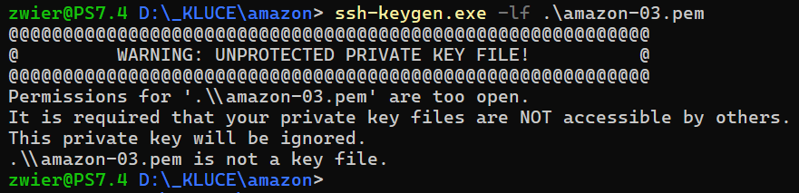

## Cieľ

Chcem nastaviť prístupové práva pre súbor so súkromným OpenSSH kľúčom v príkazovom riadku, napríklad pomocou PowerShell v prostredí operačného systému MS Windows 10/11.

Lebo napríklad, keď exportujem súkromný kľúč z formátu .ppk (pomocou PuTTYgen) do formátu .pem, tak ten novo vytvorený kľúč má príliš benevolentne nastavené prístupové práva.



---

## Riešenie

Na zmenu alebo nastavenie prístupových práv pre súbor vo Windows môžem použiť príkaz [icacls](https://learn.microsoft.com/en-us/windows-server/administration/windows-commands/icacls).

Napríklad ak chcem udeliť práva len vlastníkovi súboru (podobne ako chmod 400 v Linuxe):

```sh
icacls.exe .\key.pem /reset
icacls.exe .\key.pem /grant:r "$($env:username):(r)"
icacls.exe .\key.pem /inheritance:r
```

Vysledny stav mozem skontrolovat pomocou dalsieho prikazu [Get-Acl](https://learn.microsoft.com/en-us/powershell/module/microsoft.powershell.security/get-acl?view=powershell-7.4).

```sh
Get-Acl .\key.pem | Format-List
```

---

## Zdroj

- [How to do the CHMOD 400 Equivalent Command on Windows](https://www.youtube.com/watch?v=P1erVo5X3Bs)
