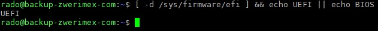

## Prvá kapitola (`##`)


  <figure class="left">Môžeš mi kúpiť kávu :)
  
  <figcaption>Ďakujem.</figcaption>
  </figure>


### Prvá podkapitola (`###`)

Štart -> Nastavenia -> Čas a jazyk -> [Jazyk](ms-settings:regionlanguage-quickime) -> Správcovské nastavenia jazyka -> Zmeniť miestne nastavenia systému...

*Italics*
  
 _Italics_
  
 __Bold__
  
 ___Bold+Italics___
  
 this_is_not_emph·asis…
  
 ~~Strike·though~~

#### Prvá podkapitola tretej úrovne (`####`)
  
 Content with a - (minus) and a -- (dash) and a --- (long dash).
  
  |&minus;|-|–|—|\
  I- -- ---I\
  I-I česko-slovenský;\
  I--I Bratislava -- Praha;\
  I---I Neuromancer --- W. Gibson;  
  H^2

---

## RAWHTML

bla with rawhtml: 

<mark> &nbsp; bla bla bla &nbsp;</mark>


and bla without rawhtml: 
<mark> &nbsp; bla bla bla &nbsp;</mark>

---

## Other elements

The <abbr title="World Health Organization">WHO</abbr> was founded in 1948.

This text contains superscript text.

This text contains subscript text.

Press <kbd>Ctrl</kbd> + <kbd>C</kbd> to copy text (Windows).

Do not forget to buy <mark>milk</mark> today.

---

Zápis v jazyku Markdown: | Výsledok:
---|---
`*Kurzíva*` | *Kurzíva*
`_Kurzíva_` | _Kurzíva_
`**Tučné**` | **Tučné**
`___Tučná kurzíva___` | ___Tučná kurzíva___
`~~Preškrtnuté~~` | ~~Preškrtnuté~~
`## Nadpis 2` |  <h2>Nadpis 2</h2> 
`[Odkaz](https://zwieratko.sk "Popis")` | [Odkaz](https://zwieratko.sk "Popis")
`` | 
`> Citácia` |  <blockquote>Citácia</blockquote> 
`* Položka` `* zoznamu` `* bez poradia` |  <ul><li>Položka</li><li>zoznamu</li><li>bez poradia</li></ul> 
`1. Položka` `2. zoznamu` `3. s poradím` |  <ol><li>Položka</li><li>zoznamu</li><li>s poradím</li></ol> 

---


  <figure class="right">
  
  <figcaption>Ďakujem.</figcaption>
  </figure>

  
 [link](https://picsum.photos/1024/768/?random)
  
 [link](http://link/path/to/target "TITLE ON LINK")
  
 [Shared Links with footnotes][target 1]
  
 [Second shared link][target 1]
  
 [target 1]
  
 [target 1]: http://footnote.com
  
 Sample inline code `a++` can be specified here.
 
 ---
 
 ## Built-in figure
 


---

## Figure-new2



---

## MD picture

---

- [x]  Lorem ipsum dolor sit amet
- [ ] Consectetur adipiscing elit
- [ ] Integer molestie lorem at massa

---


  <picture width="960" height="960">
      <source srcset="img/makovy-zavin-960px.avif" type="image/avif" />
      <source srcset="img/makovy-zavin-960px.webp" type="image/webp" />
      <source src="makovy-zavin-960px.jpg" type="image/jpeg" />
      
  </picture>

